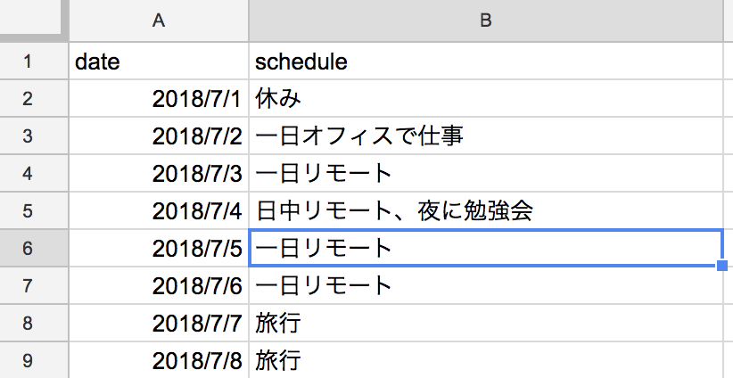
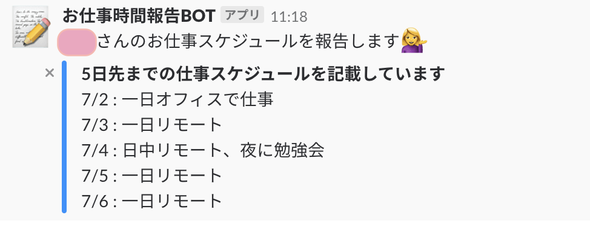

# notice-googlespreadsheets-schedule-to-slack

Notice Google Spread Sheets Schedule To Slack

## Usage

1. Write your schedule at Google spread sheets

2. Setup Google apps script ([here](./scripts/notice.js))  This spread sheet. And Please set it to run automatically at your optional time.
3. Your will find Notification to Slack!

